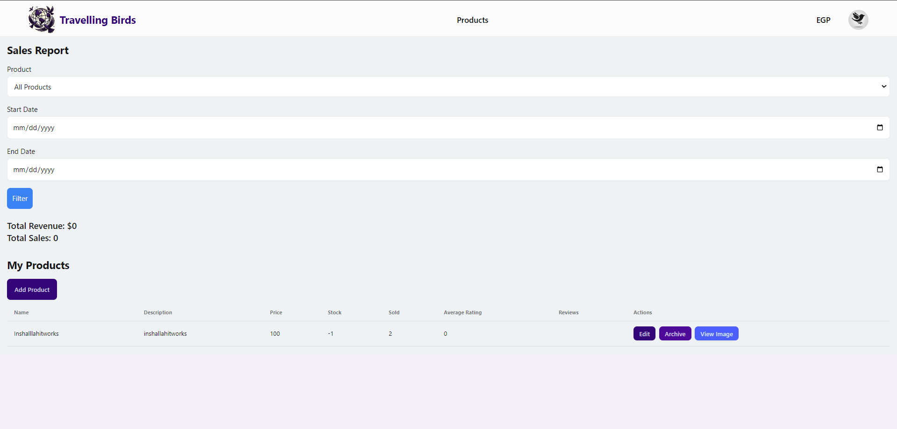

# Travelling Birds

Travelling Birds is your ultimate travel companion, designed to simplify and enrich your travel experiences. The platform offers personalized travel planning tailored to your interests, seamless booking for flights, hotels, and transportation, and budgeting tools to ensure stress-free planning. Discover curated local gems, enjoy expert-guided itineraries, and stay informed with real-time notifications for your bookings and events. Complete your journey with exclusive souvenirs from our in-app gift shop. Travelling Birds combines convenience, personalization, and discovery to make every trip unforgettable.

## Motivation
Travel planning can often feel overwhelming, with countless websites, apps, and recommendations to navigate. We created Travelling Birds to bridge the gap between personalization and convenience in trip planning. Inspired by platforms like TripAdvisor, our aim is to offer a one-stop solution that caters to all travel needs from booking and budgeting to exploring local gems and managing itineraries.

We were motivated by the desire to help travelers save time, reduce stress, and focus on enjoying their adventures. Whether you're a seasoned traveler or planning your first trip, Travelling Birds ensures every journey is seamless and memorable.

## Build Status
The project is fully developed and operational. All core features, including personalized travel planning, seamless booking, budgeting tools, curated local gems, tour guide itineraries, gift shop, and real-time notifications, have been successfully implemented and tested.

#### Known Issues:
* Occasional delays in real-time notifications for low-bandwidth networks.
* User preferences are not tied to explore page.
* Ocassional delays in loading pages due to size of database and images.

##  Code Style
The project adheres to the following coding styles:

* Frontend (React): JavaScript follows the StandardJS style guide for clean and consistent code.
* CSS Framework: Tailwind CSS components are used to maintain a consistent and modular design system.
* Backend (Node.js): Code follows ESLint configuration aligned to the Airbnb Style Guide.

All contributors are encouraged to follow these styles to ensure uniformity and maintainability throughout the project.

## Screenshots

#### 1. **Registeration Page**  
   

#### 2. **Admin Portal**  
   

#### 3. **Explore Page**  
   

#### 4. **Product Page**  
   

#### 5. **Tourist Dropdown**  
   

#### 6. **Profile Page**  
   

#### 7. **Booking Page**  
   

#### 8. **Hotel Page**  
   

#### 9. **Flight Page**  
   

#### 10. **Transportation Page**  
   

#### 11. **Complaints Page**  
   

#### 12. **Tourist My Booking Page**  
   

#### 13. **Redeem Points Page**  
   

#### 14. **Cart Page**  
   

#### 15. **Payment Page**  
   

#### 16. **Manage Activities Page**  
   

#### 17. **Manage Itineraries Page**  
   

#### 18. **Manage Museums Page**  
   

#### 19. **Manage HP Page**  
   

#### 20. **Manage Products Page**  
   

## Tech/Framework Used
The project leverages the following technologies and frameworks:

#### Frontend:
* React.js for building the user interface.
* Tailwind CSS and DaisyUI for responsive and customizable styling.

#### Backend:
* Node.js and Express.js for creating robust server-side logic.
* Nodemailer for sending email notifications.
* MongoDB as the database for storing user data, preferences, and bookings.

#### APIs and Integrations:
* Amadeus API: For flight and hotel booking.
* Google Maps API: For navigation and directions.
* Stripe API: For secure payment processing and seamless transactions within the app.
* Email Notifications: Nodemailer with Gmail SMTP for sending real-time notifications and alerts.

#### Development Tools:
* ESLint and Prettier for code linting and formatting.
* Git for version control.

## Features
* Tailored Travel Planning:
Plan trips your way with options to prioritize historic sites, sandy beaches, shopping hubs, or budget-friendly adventures, all customized to your preferences.

* Effortless Booking:
Book flights, hotels, and transportation seamlessly within the app, leveraging trusted third-party services for a quick and hassle-free experience.

* Budget-Friendly Suggestions:
Make every penny count with activity recommendations that fit your remaining budget, including transportation costs, so you can plan stress-free.

* Discover Hidden Gems:
Explore a curated selection of must-visit activities, cultural landmarks, and local attractions, complete with pricing details and directions.

* Stay Notified in Real Time:
Keep track of all your bookings and planned activities with instant app and email notifications, ensuring you’re always in the know.

* Guided Adventures & DIY Itineraries:
Choose professionally guided tours or build your own schedule with flexible itineraries that include detailed activity overviews.

* Exclusive Souvenirs & Local Finds:
Browse the in-app gift shop for unique souvenirs and local treasures, making your trip even more memorable.

## Code Examples

You can access code examples from [here](./CODEEXAMPLES.md).

## Installation
#### Prerequisites:
* Node.js: Install Node.js (v14 or higher recommended).
* MongoDB: Ensure MongoDB is installed and running on your machine or set up a cloud MongoDB cluster (e.g., MongoDB Atlas).
* Git: Install Git for version control.

#### Steps:
* Clone the Repository

        git clone https://github.com/Advanced-computer-lab-2024/Travelling-Birds.git 
        cd Travelling-Birds
* Install Backend Dependencies Navigate to the backend directory and install dependencies:

        cd backend
        npm install
* Set Up Environment Variables Create a .env file in the backend directory with the following keys:

        MONGO_URI=your-mongodb-connection-string
        PORT=your-port
        AMADEUS_CLIENT_ID=your-amadeus-client-id
        AMADEUS_CLIENT_SECRET=your-amadeus-client-secret
        GMAIL_USER=your-admin-gmail
        GMAIL_PASS=your-admin-gmail-password
        STRIPE_SECRET_KEY=your-stripe-secret-key
        STRIPE_PUBLIC_KEY=your-stripe-public-key

* Set Up Environment Variables Create a .env file in the frontend directory with the following keys:

        REACT_APP_BACKEND=http://localhost:(your-port)
        REACT_APP_STRIPE_PUBLIC_KEY=your-stripe-public-key

* Run the Backend Start the backend server:

        node App.js

* Install Frontend Dependencies Navigate to the frontend directory and install dependencies:

        cd ../src
        npm install

* Start the Frontend Start the React development server:

        npm start   

* Access the Application Open your browser and navigate to:

        http://localhost:(your-port)

## API Reference

This project integrates with several external APIs to provide core functionalities like flights, hotels, email, and payment processing. Below are the details of the external APIs used, including links to their official documentation and how they are implemented in this project. If you are looking for internal apis you can access them [here](./APIREFERENCES.md).

---

## 1. Amadeus Flight API

The Amadeus API is used for flight search, booking, and retrieving flight details.

- **Documentation**: [Amadeus Flights API](https://developers.amadeus.com/self-service/category/flights)

### Endpoints in Project
- **Search Flights**
    ```http
    POST /api/flights/search
    ```
    **Request Body**:
    ```json
    {
      "origin": "CAI",
      "destination": "DXB",
      "departureDate": "2024-12-15",
      "currencyCode": "USD"
    }
    ```
    **Response**: A list of available flight offers.

- **Get Flight Details**
    ```http
    GET /api/flights/:flightId
    ```
    Fetches detailed information about a specific flight.

- **Book Flight**
    ```http
    POST /api/flights/book
    ```
    **Request Body**:
    ```json
    {
      "flightDetails": {/* flight details */},
      "travelerInfo": {/* traveler details */}
    }
    ```
    Confirms and books the selected flight.

---

## 2. Amadeus Hotel API

The Amadeus API is used for hotel search, details retrieval, and booking.

- **Documentation**: [Amadeus Hotels API](https://developers.amadeus.com/self-service/category/hotels)

### Endpoints in Project
- **Search Hotels**
    ```http
    POST /api/hotels/search
    ```
    **Request Body**:
    ```json
    {
      "cityCode": "NYC",
      "checkInDate": "2024-12-20",
      "checkOutDate": "2024-12-25",
      "adults": 2,
      "currencyCode": "USD"
    }
    ```
    **Response**: A list of available hotels in the specified city.

- **Get Hotel Details**
    ```http
    GET /api/hotels/:hotelId
    ```
    Fetches detailed information about a specific hotel.

- **Book Hotel**
    ```http
    POST /api/hotels/book
    ```
    **Request Body**:
    ```json
    {
      "hotelId": "12345",
      "travelerDetails": {/* traveler details */},
      "checkInDate": "2024-12-20",
      "checkOutDate": "2024-12-25"
    }
    ```
    Books the selected hotel.

---

## 3. Nodemailer (Email API)

Nodemailer is used to send transactional emails via Gmail SMTP.

- **Documentation**: [Nodemailer Usage](https://www.nodemailer.com/usage/)

### Endpoint in Project
- **Send Email**
    ```http
    POST /api/email/send
    ```
    **Request Body**:
    ```json
    {
      "email": "user@example.com",
      "subject": "Welcome to Traveling Birds!",
      "message": "Thank you for registering with us."
    }
    ```
    Sends an email to the specified recipient.

---

## 4. Stripe Payment API

Stripe is used for processing payments.

- **Documentation**: [Stripe API Documentation](https://docs.stripe.com/api/payment_intents)

### Endpoint in Project
- **Create Payment**
    ```http
    POST /api/payments
    ```
    **Request Body**:
    ```json
    {
      "amount": 5000,
      "currency": "USD",
      "paymentMethodId": "pm_card_visa"
    }
    ```
    **Response**:
    ```json
    {
      "success": true,
      "paymentIntent": {/* payment intent details */}
    }
    ```
    Processes a payment and confirms it.

---

### How to Get Started
To use these APIs in your own project:
1. Register with the respective service providers.
2. Obtain API keys or credentials.
3. Replace placeholders (e.g., `process.env.API_KEY`) in the code with your actual credentials.

These APIs provide the backbone for critical features like travel bookings and payments, ensuring a smooth user experience.


## Tests

You can access test examples from [here](./TESTEXAMPLES.md).

## How to Use
#### 1. Log in, register or continue as guest:

&nbsp;&nbsp;&nbsp;&nbsp;&nbsp;&nbsp; - Visit the homepage of the application. 

&nbsp;&nbsp;&nbsp;&nbsp;&nbsp;&nbsp; - You can continue as a guest, create an account, or log in if you already have an account.

#### 2. Plan Your Trip

&nbsp;&nbsp;&nbsp;&nbsp;&nbsp;&nbsp; - Use the Personalized Travel Planning feature to specify your preferences, such as destinations, activities, and budget.

&nbsp;&nbsp;&nbsp;&nbsp;&nbsp;&nbsp; - The app will generate tailored suggestions based on your input.

#### 3. Explore Local Attractions:

&nbsp;&nbsp;&nbsp;&nbsp;&nbsp;&nbsp; - In the explore page, discover and select an activity, itineray, historical place or museum you find interesting.

&nbsp;&nbsp;&nbsp;&nbsp;&nbsp;&nbsp; - After clicking what you find interesting, you can view more details. In addition, you can book it, save it for later, or share it.

#### 4. Shop for Souvenirs:

&nbsp;&nbsp;&nbsp;&nbsp;&nbsp;&nbsp; - Visit the gift shop to purchase unique souvenirs and local items with variable quantities.

#### 5. Make Payments:

&nbsp;&nbsp;&nbsp;&nbsp;&nbsp;&nbsp; - Use the secure Stripe-powered payment gateway to finalize bookings and purchases.


#### 6. Provide Feedback:

&nbsp;&nbsp;&nbsp;&nbsp;&nbsp;&nbsp; - After a booked item is completed or a product is purchased, you can rate and comment on it.

&nbsp;&nbsp;&nbsp;&nbsp;&nbsp;&nbsp; - You can also share your experience on a tour guide that you completed a tour with.

#### 7. Book Your Travel

&nbsp;&nbsp;&nbsp;&nbsp;&nbsp;&nbsp; - Browse and book flights, hotels, and transportation directly within the website.

&nbsp;&nbsp;&nbsp;&nbsp;&nbsp;&nbsp; - Use the seamless booking system powered by the trusted amadeus service.

#### 8. Stay Updated

&nbsp;&nbsp;&nbsp;&nbsp;&nbsp;&nbsp; - Receive real-time updates about your bookings and events on the website or through mail.

#### 9. Adjust Profile

&nbsp;&nbsp;&nbsp;&nbsp;&nbsp;&nbsp; - Edit your profile to adjust it to your tastes.

#### 10. Access Help and Support

&nbsp;&nbsp;&nbsp;&nbsp;&nbsp;&nbsp; - Communicate and report any dissatisfaction through the complaints system.

#### 11. Other Roles

- Admin
  
&nbsp;&nbsp;&nbsp;&nbsp;&nbsp;&nbsp; - Manage users, monitor complaints, and oversee the system’s overall health.

&nbsp;&nbsp;&nbsp;&nbsp;&nbsp;&nbsp; - Access to analytics and platform settings.

- Advertiser
  
&nbsp;&nbsp;&nbsp;&nbsp;&nbsp;&nbsp; - Create and manage activities displayed across the website.

&nbsp;&nbsp;&nbsp;&nbsp;&nbsp;&nbsp; - Access insights on my created activities performance.
- Seller
  
&nbsp;&nbsp;&nbsp;&nbsp;&nbsp;&nbsp; - Add and manage products in the gift shop.

&nbsp;&nbsp;&nbsp;&nbsp;&nbsp;&nbsp; - View and handle orders placed by users.
- Tour Guide
  
&nbsp;&nbsp;&nbsp;&nbsp;&nbsp;&nbsp; - Create and manage itineraries displayed across the website.

&nbsp;&nbsp;&nbsp;&nbsp;&nbsp;&nbsp; - Access insights on my created itineraries performance.


## Contribute
We’re always excited to welcome contributions to Travelling Birds! Whether you want to report bugs, suggest new features, or enhance existing functionality, your input is invaluable.

#### How to Contribute
 - Fork the Repository: Create a copy of this repository under your GitHub account.
 - Make Changes: Implement your ideas while following the project’s coding style and guidelines.
 - Submit a Pull Request: Once your changes are ready, submit a pull request with a brief description of what you’ve done.

For more details, feel free to check out our contribution guidelines in the repository.
Thank you for helping us make Travelling Birds better for everyone!

## Credits
We would like to acknowledge the following for their invaluable contributions to the development of Travelling Birds:

#### Inspiration:
The project was inspired by TripAdvisor, a platform known for its comprehensive travel planning features.
#### API Providers:

 - Amadeus API: For enabling seamless flight and hotel bookings.
 - Google Maps API: For navigation and directions.
 - Stripe API: For secure payment processing.
 - Nodemailer with Gmail SMTP: For sending real-time notifications and alerts.

A heartfelt thanks to the team members and contributors who worked tirelessly to bring this project to life.
[](https://github.com/Advanced-computer-lab-2024/Travelling-Birds/graphs/contributors)

## License

This project is licensed under the MIT License.

Third-Party Licenses
The following third-party services are used in this project and are subject to their respective licenses:

 - Stripe: Licensed under the Apache 2.0 License.
 - Amadeus: Usage of the Amadeus API is subject to their API Terms and Conditions.
 - Google Maps API: Subject to the Google Maps Platform Terms of Service.
 - Gmail SMTP: Used with Nodemailer for sending email notifications, subject to Gmail's Terms of Service.
Please ensure compliance with the terms of these licenses when using or modifying this project.
For more details, see the [LICENSE](./LICENSE.md) file.
